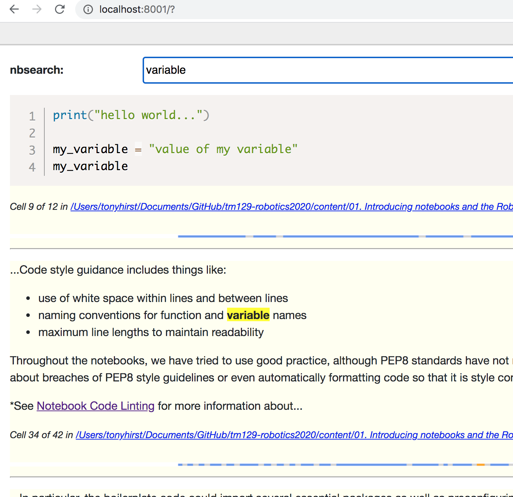

# `nbsearch`
Datasette based notebook search extension, originally inspired by Simon Willison's [Fast Autocomplete Search for Your Website](https://24ways.org/2018/fast-autocomplete-search-for-your-website/).

Related: [Sketching a datasette powered Jupyter Notebook Search Engine: nbsearch](https://blog.ouseful.info/2020/10/26/sketching-a-jupyter-notebook-search-engine/)

## Installation

`pip3 install --upgrade git+https://github.com/ouseful-testing/nbsearch.git`

## Usage - inside Jupyter notebook environment

*This is still very much a work in progress. I think it works in Binder (erm, maybe...)*

Installing the extension and restarting the Jupyter server should make a Jupyter proxy served version of the search form available from the `New` menu.

At the moment, I think you need to create the index explicitly. From the command line:

`nbsearch index -p PATH`

(From a notebook command cell, prefix with `!`. Default path is `.`).

The sqlite db that stores the results is in `~/.nbsearch/notebooks.sqlite`.

All notebooks down from `PATH` will be indexed. 

When you have generated an index, launch the `nbsearch` panel from the notebook homepage *New* menu.

## Usage - from the command line

- create a database by passing a path to some notebook files, eg:
  - `nbsearch index -p "/Users/myuser/Documents/content/notebooks"`
- run the server, eg:
  -  `nbsearch serve`

  
`datasette` should start up and display a server port number. (To kill it, I look for process IDs: `ps -al |grep datasette`; there is probably a better way... It  might be nice if CLI kept track of process IDs and let you kill from a selection?)

## UI

*Old screenshot*

A *copy* button on a code cell lets you copy code from the code cell.

Results are limited in length; the *Show all cell* button expands the result cell to its full length. The *Show previous cell* and *Show next cell* buttons display the full previous / next cell (repeatedly clicking these buttons grab the next next and previous previous cells etc.)

Clicking on the notebook structure visualisation graphic (the pink/blue image: the colours representent cell type and relative length) will collapse / reveal the display of the result block.

## Known Issues

The links to notebooks may well be broken in the search results: I need to think about how to index and handle paths in links, particular in proxy server case.

The app requires the latest version of `datasette` from the repo, not pypi.

The index is not updated *ever* unless you rerun the indexer, although I've started trying to ponder a filesystem watchdog [here](https://github.com/ouseful-testing/nbsearch/blob/main/nbsearch/nbwatchdog.py). Another possibility my be a Jupyter notebook content manager or post-save hook to update records as the notebook server saves them but this would not catch filesystem operations (dragging new notebooks to a folder, deleting notebooks etc?)

If the sqlite db is updated, I assume by some magic that the `datasette` server queries over the updated content?

## Useful

Quick way to kill `datasette` processes: `ps aux | grep datasette | grep -v grep | awk '{print $2}' | xargs kill`
